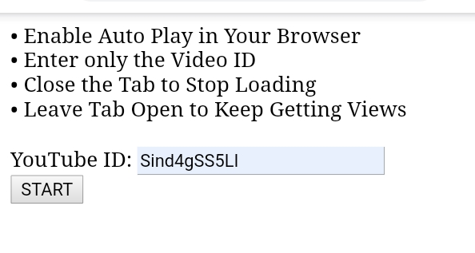

ViewTube
======
PHP YouTube Viewing Bot with a Random Proxy &amp; Random User Agent 
   

## Usage
* Copy To Hosting Provider
* Open a desired YouTube video and select Share
* Select the Embedded Link option     
( this enables embedding on the video if it wasn't already enabled )    

* Now grab the Video ID from the YouTube Link - after enabling embedding.
* Open Index.php and enter your link.

### Try It Now
 

## Technology
* HTML
* PHP
